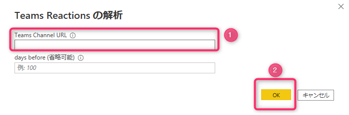
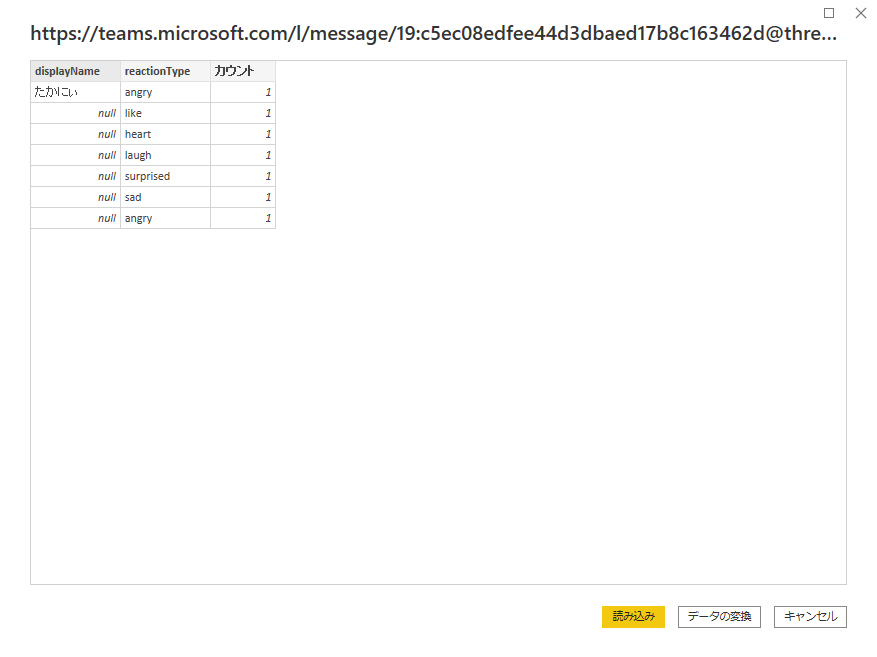
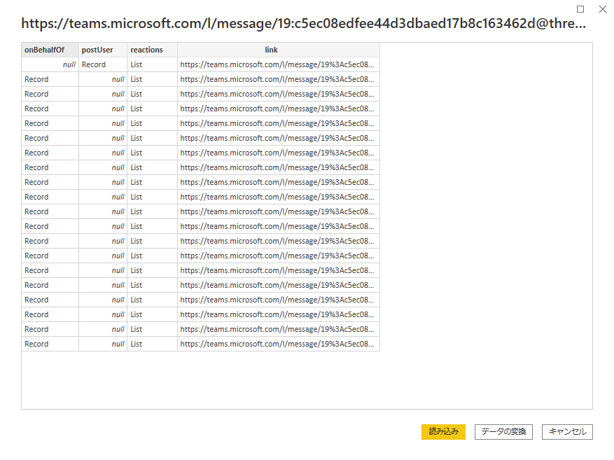

# PQExtensionTeamsReactions
Power Query Custom Connector to retreive Teams Reactions in a channel by a message link in the channel. 

# purpose
To analyze Microsoft Teams Reactions in the channel by Power BI

# Qiita in Japanese  
[release Microsoft Teams custom data connector for Power BI](https://qiita.com/baku2san/items/423a272074422d6a43c4)

# how to use
1. paste Forms URL in the url ex.) https://teams.microsoft.com/l/message/{channelId}/{messageId}?tenantId={tenantId}&groupId={groupId} 
1. connect, then retreive reactions. 
## sample

## details sample

# about Forms API 
[Microsoft Forms API in my view](https://qiita.com/baku2san/items/47c8ad906e01d7e5d5b9)

# Data Connector 
[details and samples by Microsoft](https://github.com/microsoft/DataConnectors)

# authentication

[aad authentication](https://docs.microsoft.com/ja-jp/power-query/handlingauthentication#azure-active-directory-authentication) 

## [OAuth2](https://docs.microsoft.com/en-us/azure/active-directory/develop/v2-oauth2-auth-code-flow)

